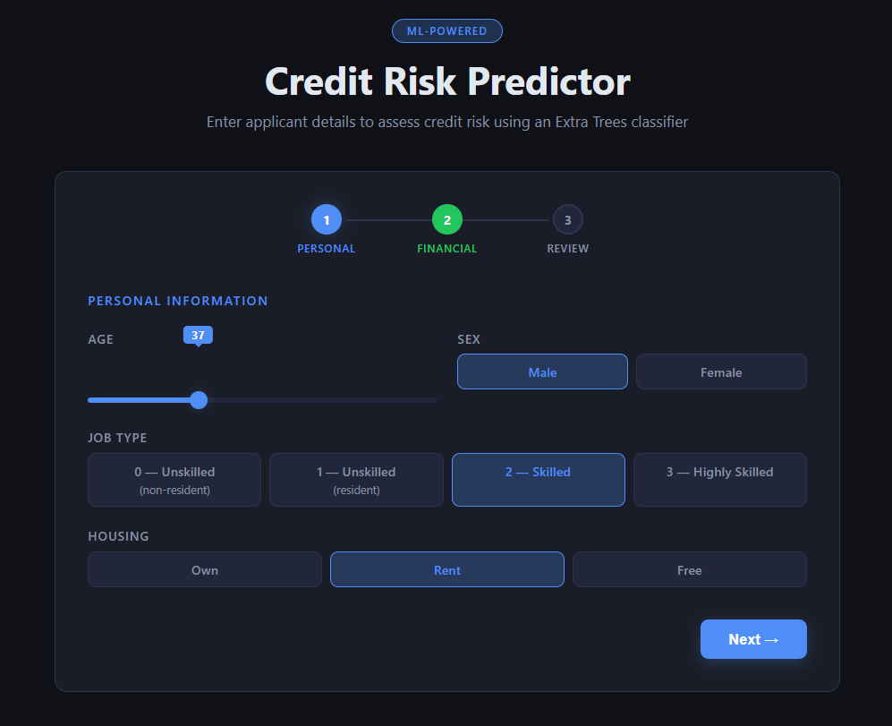

# Credit Risk Modelling Using Machine Learning

A machine learning project that predicts whether a loan applicant carries **Good** or **Bad** credit risk. The repository ships an end-to-end pipeline — from raw data exploration to a trained Extra Trees classifier — plus a polished dark-mode web UI backed by a Flask REST API.

---

## Preview

> **Add a screenshot:** take a browser screenshot of the running app and save it as `screenshots/preview.png`, then this image will render automatically.



---

## Architecture

```
german_credit_data.csv  →  model_training.ipynb  →  models/*.pkl
                                                          ↓
                                              server.py  (Flask API)
                                                  ↓
                                          frontend/index.html
```

| Component | Purpose |
|---|---|
| `model_training.ipynb` | Full ML pipeline: EDA, preprocessing, training, hyperparameter tuning, artifact export |
| `server.py` | Flask REST API — serves the frontend and exposes `POST /predict` |
| `frontend/index.html` | Dark-mode multi-step UI built with vanilla HTML/CSS/JS |
| `app.py` | Legacy Streamlit app (still functional as an alternative interface) |
| `models/` | Serialized Extra Trees model and five label encoders |

---

## Features

- **Multi-step wizard UI** — Personal → Financial → Review → Prediction, with animated step indicators
- **Real-time prediction** — probability bars animate to show Good / Bad confidence scores
- **Extra Trees classifier** selected after GridSearchCV comparison against Decision Tree, Random Forest, and XGBoost (all trained with `class_weight='balanced'`)
- **Label-encoded categoricals** — five dedicated encoders serialized alongside the model
- **Flask API + CORS** — clean JSON contract between frontend and backend
- **Legacy Streamlit app** kept for quick local exploration

---

## Dataset

`german_credit_data.csv` — 1,000 credit records from the German Credit dataset.

| Column | Type | Notes |
|---|---|---|
| `Age` | numeric | Applicant age in years |
| `Sex` | categorical | male / female |
| `Job` | numeric (0–3) | 0 unskilled non-res → 3 highly skilled |
| `Housing` | categorical | own / rent / free |
| `Saving accounts` | categorical | little / moderate / quite rich / rich |
| `Checking account` | categorical | little / moderate / rich |
| `Credit amount` | numeric | Loan amount in € |
| `Duration` | numeric | Loan duration in months |
| `Purpose` | categorical | (used during EDA, dropped before modelling) |
| `Risk` | categorical | **Target** — good / bad |

---

## Model Training

Open `model_training.ipynb` and run all cells. The notebook:

1. Loads and explores `german_credit_data.csv` (univariate/multivariate analysis, skewness, kurtosis, correlation heatmaps)
2. Drops null rows and an unnamed index column
3. Label-encodes all categorical columns including the target
4. Trains and tunes four classifiers via `GridSearchCV`: Decision Tree, Random Forest, Extra Trees, XGBoost
5. Serializes the winning **Extra Trees** model and five encoders to `models/`

---

## Project Structure

```text
credit-risk-modelling-using-ml/
├── frontend/
│   └── index.html              # Dark-mode multi-step prediction UI
├── models/
│   ├── extra_trees_credit_model.pkl
│   ├── Sex_encoder.pkl
│   ├── Housing_encoder.pkl
│   ├── Saving accounts_encoder.pkl
│   ├── Checking account_encoder.pkl
│   └── target_encoder.pkl
├── screenshots/                # Add preview.png here
├── app.py                      # Legacy Streamlit interface
├── server.py                   # Flask API + static file server
├── model_training.ipynb
├── german_credit_data.csv
├── requirements.txt
└── README.md
```

---

## Installation

```bash
git clone <your-repository-url>
cd credit-risk-modelling-using-ml
```

**Using conda (recommended):**

```powershell
conda create -n credit-risk python=3.10
conda activate credit-risk
pip install -r requirements.txt
```

**Using venv:**

```bash
python -m venv venv
# Windows
venv\Scripts\activate
# macOS / Linux
source venv/bin/activate
pip install -r requirements.txt
```

---

## Running the App

### Flask frontend (new)

```bash
python server.py
```

Open [http://localhost:5000](http://localhost:5000) in your browser.

The multi-step wizard collects applicant details, calls `POST /predict`, and animates the result with probability bars.

### Streamlit app (legacy)

```bash
streamlit run app.py
```

Open [http://localhost:8501](http://localhost:8501).

---

## API Reference

### `POST /predict`

**Request body (JSON):**

```json
{
  "age": 35,
  "sex": "male",
  "job": 2,
  "housing": "own",
  "saving_accounts": "moderate",
  "checking_account": "little",
  "credit_amount": 5000,
  "duration": 24
}
```

**Response:**

```json
{
  "prediction": 1,
  "label": "GOOD",
  "confidence": 78.5,
  "prob_good": 78.5,
  "prob_bad": 21.5
}
```

`prediction` is `1` for Good risk, `0` for Bad risk.

---

## Saved Artifacts

| File | Purpose |
|---|---|
| `models/extra_trees_credit_model.pkl` | Trained Extra Trees classifier |
| `models/Sex_encoder.pkl` | Encoder for `Sex` |
| `models/Housing_encoder.pkl` | Encoder for `Housing` |
| `models/Saving accounts_encoder.pkl` | Encoder for `Saving accounts` |
| `models/Checking account_encoder.pkl` | Encoder for `Checking account` |
| `models/target_encoder.pkl` | Encoder for target labels |

> The encoder filenames contain spaces — preserve them exactly. scikit-learn `.pkl` files are not cross-version compatible; use the same scikit-learn version that produced them.

---

## Technologies

| Layer | Stack |
|---|---|
| Data & ML | Python, Pandas, NumPy, Scikit-learn, XGBoost, Joblib |
| Visualization | Matplotlib, Seaborn |
| Backend | Flask, Flask-CORS |
| Frontend | Vanilla HTML5, CSS3, JavaScript (no framework) |
| Notebook | Jupyter |

---

## Future Improvements

- Add SHAP value explainability panel to the frontend
- Expose model metrics (precision, recall, F1, confusion matrix) via a `/metrics` endpoint
- Containerize with Docker for one-command deployment
- Add input validation and rate limiting to the Flask API
- Build a scikit-learn `Pipeline` to eliminate manual encoder management on retrain

---

## Disclaimer

This project is for educational and portfolio purposes. Credit decisions in production financial systems require stronger validation, fairness testing, regulatory review, monitoring, and human oversight.
